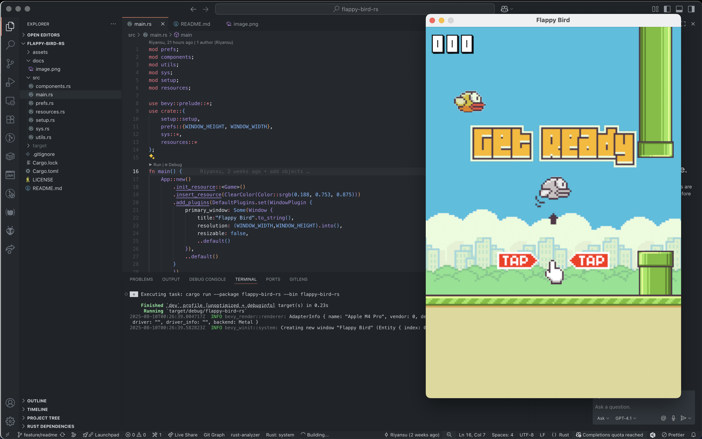

# flappy-bird-rs

A small **Flappy Bird** clone built to practice **Rust** and **Bevy**.

> This repository is a **clone / re-implementation** of the original project:
> **[`aaarafat/JS-Flappy-Bird`](https://github.com/aaarafat/JS-Flappy-Bird)**
> It exists purely for learning and experimentation. Big thanks to the original author 🙏

---

## Purpose

* Practice writing game logic in **Rust** using **Bevy’s ECS**.
* Learn the basics of 2D game development in Bevy (sprites, simple physics, collisions, states, score, UI).
* Translate concepts from a JavaScript implementation into a Rust/Bevy architecture.

## Attribution & License

* **Upstream inspiration**: [`aaarafat/JS-Flappy-Bird`](https://github.com/aaarafat/JS-Flappy-Bird)
* **This repository’s license**: see `LICENSE` in this repo.
* All trademarks, art, and audio belong to their respective owners. This is a learning project and not affiliated with the original creators. If you reuse assets, please verify their licenses.

Contributions, suggestions, or learning notes are welcome!
